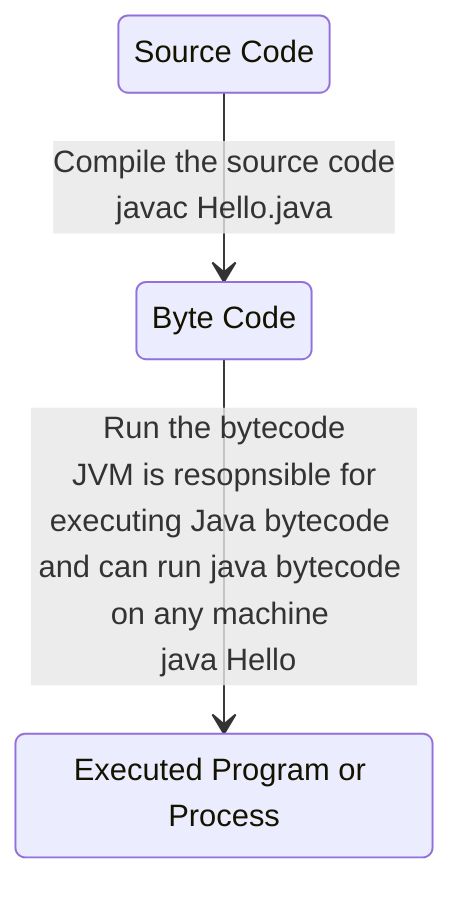
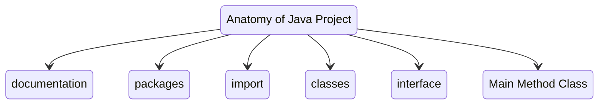

## Introduction to Computer programs and Java

### How a java program executes

- Note: `java Hello` command can be used for both running or compile then run a java program. If Hello is a compiled bytecode 'Hello.class' then it is executed, else if its a java program it will be compiled then executed

## Types of errors
- Syntax
- Runtime
- Logic

## Naming Convention
- Functions: camelCasing
- Classes: PascalCasing

## Anatomy of Java Project

