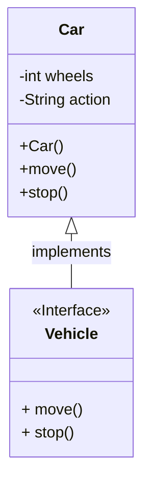
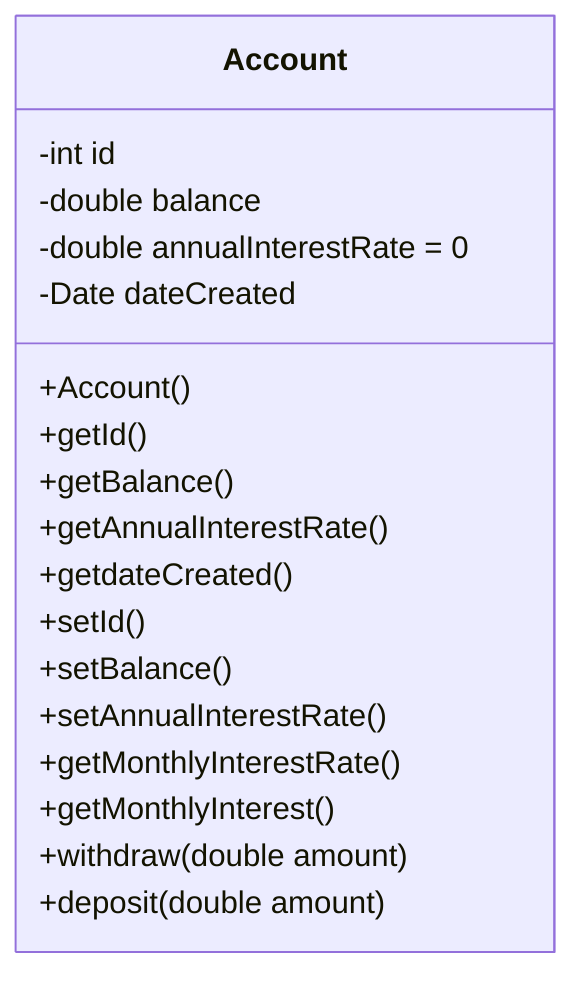
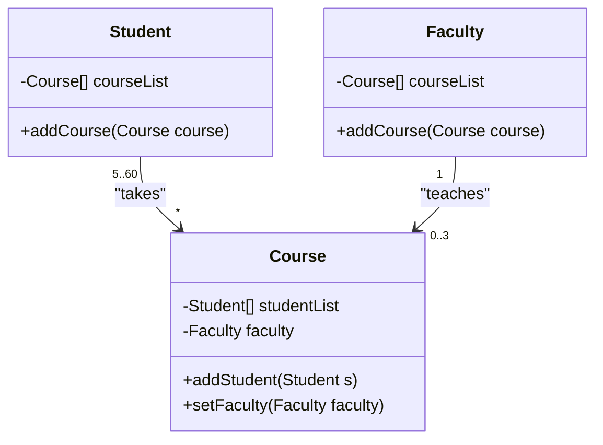
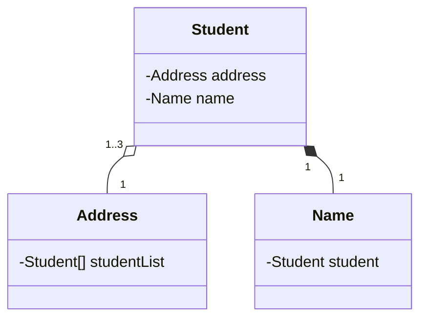
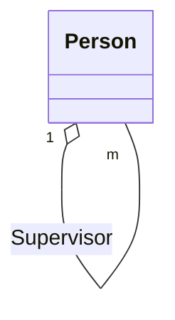
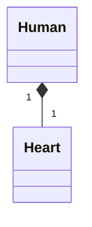
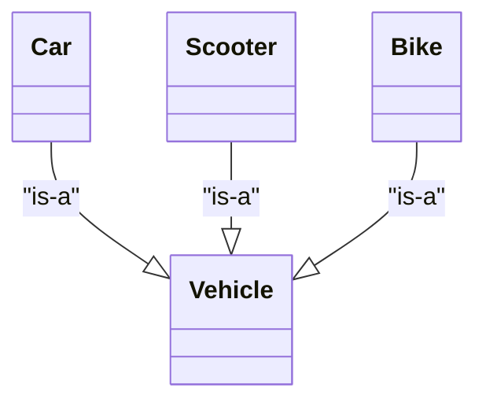

## Object Oriented Thinking

#### Abstraction
>It can be defined as seperation of class implementation from the use of the class.

Eg:

Here, **Vehicle** interface provides the necessary methods which needs to be implemented by any class which is implementing the **Vehicle** interface.

#### Encapsulation
> It can be defined as wrapping up of data into single unit, providing only necessary details for use to client.

Eg:

In **Account** class, the **data members** are hidden from the user and are only exposed with the help of **public** **getters** and **setters**.

#### Class relationships

###### Association
> It defines a general relationship between classes which can be one to one, one to many, many to one, many to many

###### Aggregation
> Denotes **has-a** relationship
> Child class can exist independently of parent
> Eg: Student has an address, Bank has an employee

**Note:** Aggregation can exist between objects of the same class

###### Composition
> Denotes **part-of** relationship
> Child class can't exist independently of parent
> If a composite is deleted, all other parts associated with it are deleted.
> Eg: name is a part of student, heart is a part of human

###### Inheritance
> Denotes **is-a** relationship

#### Interned String
![[Ch10-1666970802342.jpeg]]

#### Todos
- [x] Practice BigInteger class ✅ 2022-10-30
- [x] Practice String class ✅ 2022-11-05
- [ ] Practice Regex
- [x] Practice Questions ✅ 2022-10-30