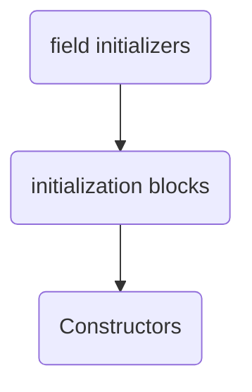

## Objects and Classes

#### [Visibility Modifiers](https://www.programiz.com/java-programming/access-modifiers)

| Visibility Modifier | Visibility                                                         |
| -------------------- | ------------------------------------------------------------------ |
| Default              | declarations are visible only within the package (package private) |
| Private              | declarations are visible within the class only                     |
| Protected            | declarations are visible within the package or all subclasses      |
| Public               | declarations are visible everywhere                                |

#### Constructors
###### Note
- They don't have a return type, not even **void**
- They can be **non-public**
	- This limits which code can perfom a specific type of instance creation for a class

###### Initalization and construction order

###### Static Initialization Blocks
- Performs one-time initialization
- Has access to static memebers only

#### Reference Types
- Possible Reference Types
	- Annotation
	- Array
	- Class
	- Enumeration
	- Interface
- All reference types are a subclass of type **java.lang.Object**

#### UML Diagrams 
[[Fan]]
[[Stock]]
[[Account]]
[[Rectangle]]
[[Stopwatch]]

