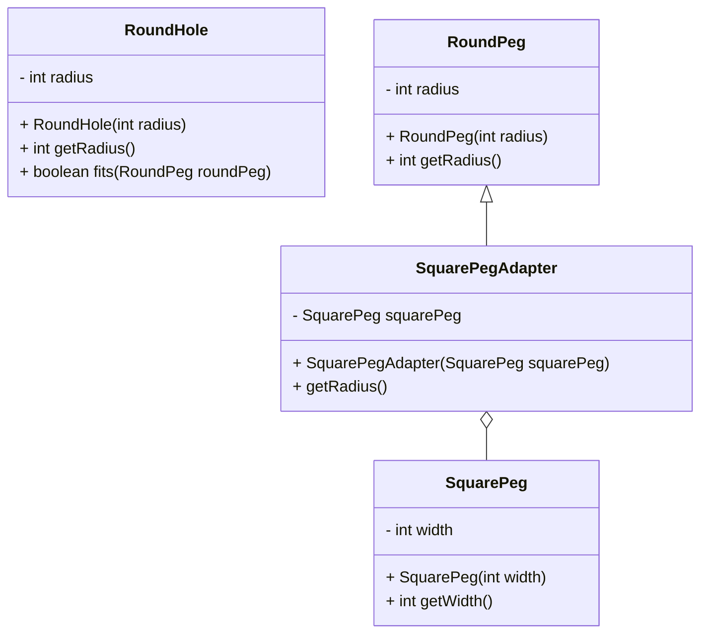

#### When applicable?
- You need to use existing class but interface doesn't match the one you require.
- You need to use several existing subclasses but its impractical to adapt there features by subclassing every one of them

#### Explanation
[[adapterPattern.pdf]]

#### Stucture
![[Adapter Pattern-1670743374290.jpeg]]

#### Example 
###### Design

###### Implementation Structure
![[Adapter Pattern-1670751316614.jpeg]]

#### Definition
The Adapter Pattern converts the interface of a class into another interface the clients expect. Adapter lets classes work together that couldn’t otherwise because of incompatible interfaces.

![[Adapter Pattern-1674419345832.jpeg]]

#### Todos
- [x] Find a good example and implement it ✅ 2023-01-23

