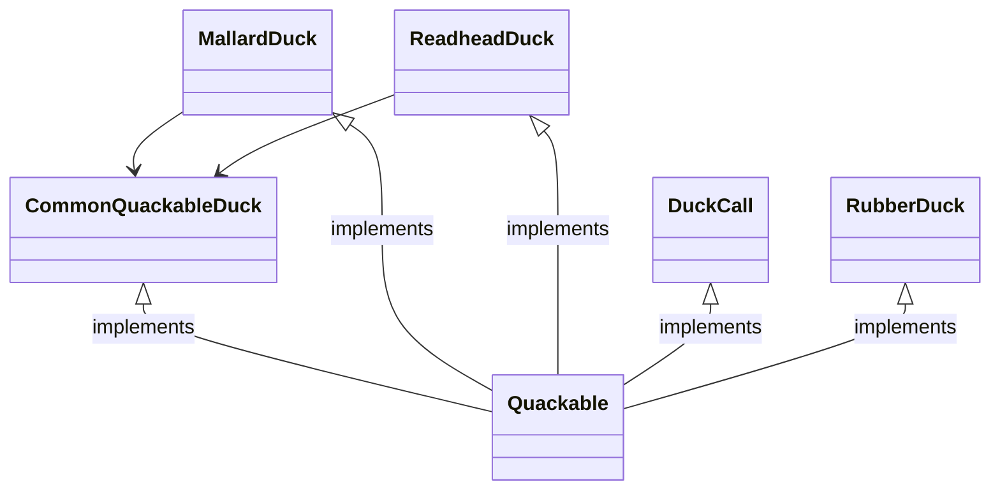
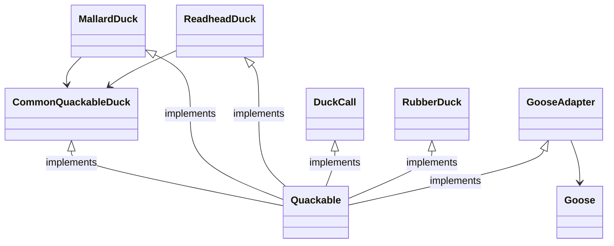
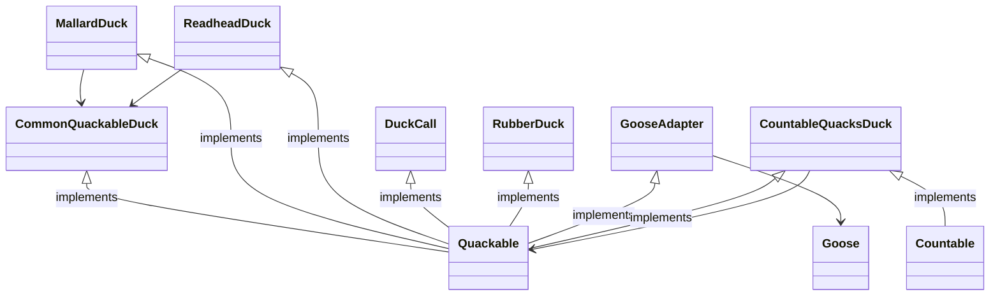

## Example

Lets have a Quackable interface
```java
public interface Quackable{
	public void quack();
}
```

Now for some ducks
Current design


```java
public class CommonQuackableDuck implements Quackable{
	public void quack(){
		System.out.println("Quack");
	}
}
public class MallardDuck implements Quackable{
	CommonQuackableDuck commonQuackableDuck;

	MallardDuck(){
		this.commonQuackableDuck = new CommonQuackableDuck();
	}

	public void quack(){
		commonQuackableDuck.quack();
	}
}
public class ReadheadDuck implements Quackable{
	CommonQuackableDuck commonQuackableDuck;

	ReadheadDuck(){
		this.commonQuackableDuck = new CommonQuackableDuck();
	}

	public void quack(){
		commonQuackableDuck.quack();
	}
}
public class DuckCall implements Quackable{
	public void quack(){
		System.out.println("Kwak");
	}
}
public class RubberDuck implements Quackable{
	public void quack(){
		System.out.println("Squeak");
	}
}
```

Now we have Goose
```java
public class Goose {
	public void honk(){
		System.out.println("Honk");
	}
}
```

For Using Goose with ducks we need and adapter
```java
public class GooseAdapter implements Quackable {
	Goose goose;

	GooseAdapter(Goose goose){
		this.goose = goose;
	}

	public void quack(){
		goose.honk();
	}
}
```



Counting duck quacks.
Which design pattern might help?
- Decorators might help

```java
public interface Countable{
	public static int countQuacks(); 
}
public class CountableQuacksDuck implements Quackable, Countable{
	Quackable quackableDuck;
	static int countOfQuacks;

	CountableQuacksDucks(Quackable quackableDuck){
		this.quackableDuck = quackableDuck;
	}

	public void quack(){
		quackableDuck.quack();
		countOfQuacks++;
	}

	public static int countQuacks(){
		return countOfQuacks;
	}
}
```



Many Duck quacks are not being counted, which pattern might help
- Factory Pattern can help us make sure that all ducks are wrapped.

Here, we use abstract factory pattern to create a family of ducks

```java
public enum DuckTypes{
	MALLARD_DUCK,
	RED_HEAD_DUCK,
	DUCK_CALL,
	RUBBER_DUCK
}

public interface AbstractDuckFactory {
	public static Quackable createDuck(DuckTypes duckType);
}

public class DuckFactory implements AbstractDuckFactory {
	public static Quackable createDuck(DuckTypes duckType){
		if(duckType == MALLARD_DUCK){
			return new MallardDuck();
		} else if(duckType == RED_HEAD_DUCK){
			return new ReadheadDuck();
		} else if(duckType == DUCK_CALL){
			return new DuckCall();
		} else if(duckType == RUBBER_DUCK){
			return new RubberDuck();
		} else {
			throw new InvalidDuckException();
		}
	}
}

public class CountingDuckFactory implements AbstractDuckFactory{
	public static Quackable createDuck(DuckTypes duckType){
		return new CountableQuacksDuck(DuckFactory.createDuck(duckType));
	}
}
```

How to manage ducks as a whole
- Composite Pattern comes to our rescue

```java
public class Flock implements Quackable {
	ArrayList<Quackable> quackers = new ArrayList<Quackable>();

	public void add(Quackable quacker){
		quackers.add(quacker);
	}

	public void quack(){
		Iterator<Quackable> iterator = quackers.iterator();
		while(iterator.hasNext()){
			Quackable quacker = iterator.next();
			quacker.quack();
		}
	}
}
```

Tracking the individual ducks
- observer pattern can handle that for us

```java
public interface QuackObservable {
	public void registerObserver(Observer observer);
	public void notifyObservers();
}

public interface Quackable extends QuackObservable{
	public void quack();
}

public class Observable implements QuackObservable{
	ArrayList<Observer> observers = new ArrayList<Observer>();
	QuackObservable duck;

	public Observable(QuackObservable duck){
		this.duck = duck;
	}

	public void registerObserver(Observer observer){
		observers.add(observer);
	}

	public void notifyObservers(){
		Iterator iterator = observers.iterator();
		while(iterator.hasNext()){
			Observer observer = iterator.next();
			observer.update(duck);
		}
	}
}

public class MallardDuck implements Quackable{
	Observable observable;

	public MallardDuck(){
		observable = new Observable(this);
	}

	public void quack(){
		System.out.println("Quack");
		notifyObservers();
	}

	public void registerObservers(Observer observer){
		observable.registerObserver(observer);
	}
	public void notifyObservers(){
		observable.notifyObservers();
	}
}

public class Flock implements Quackable {
	ArrayList<Quackable> quackers = new ArrayList<Quackable>();

	public void add(Quackable quacker){
		quackers.add(quacker);
	}

	public void quack(){
		Iterator<Quackable> iterator = quackers.iterator();
		while(iterator.hasNext()){
			Quackable quacker = iterator.next();
			quacker.quack();
		}
	}
	
	public void registerObservers(Observer observer){
		Iterator<Quackable> iterator = quackers.iterator();
		while(iterator.hasNext()){
			Quackable quacker = iterator.next();
			quacker.registerObserver(observer);
		}
	}
	public void notifyObservers(){
		// quack does the job so this does nothing :)
	}
}

public interface Observer{
	public void update(QuackObservable duck);
}

public class QuackoLogist implements Observer{
	public void update(QuackObservable duck){
		System.out.println("Quackologist: " + duck + "just quacked.");
	}
}
```

#### Model View Controller

![[Compound Pattern-1674921342200.jpeg]]


