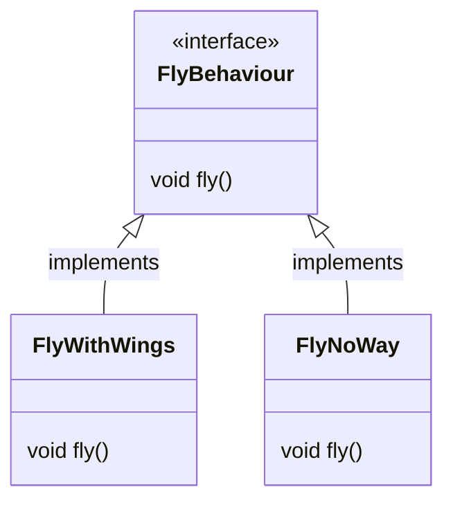

1) Identify the aspects of your application that vary and separate them from what stays the same.
2) Program to an interface, not an implementation.

3) Favor composition over inheritance.
4) Strive for loosely coupled designs between objects that interact
	1) Why loosely coupled?
5) **Open/Closed principle**: Classes should be open for extension, but closed for modification.
6) Depend upon abstractions. Do not depend upon concrete classes.
7) [[Principle of Least Knowledge]]: talk only to your immediate friends.
8) [[Hollywood Principle]]: don't call us, we will call you

