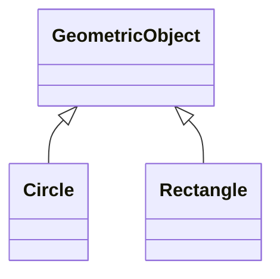
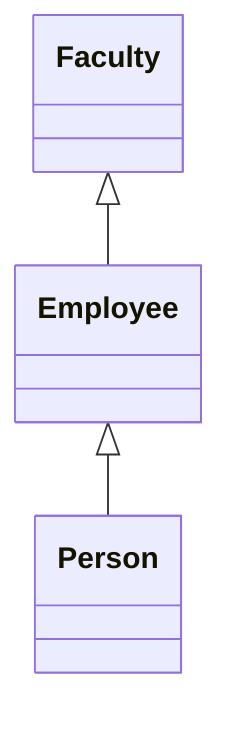
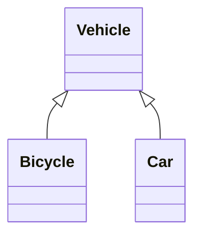

## Inheritance And Polymorphism

#### Simple Inheritance Example

> Note: Java Only Support Hierarchial Inheritance not multiple. Such use cases are covered with the help of interfaces.

#### Super Keyword
Unlike properties and methods, constructors aren't inherited and can only be called by super keyword in java.
It can also call methods.

#### Constructor Chaining
If there exists a construct as given below


Then order in which constructors are called is as follows:
1) Person
2) Employee
3) Faculty

##### Overriding Method
Inherited/Implemented class **overrides** the methods of base class with same **signature**.
> Note:
> 1) Instance method can be overridden only if its accessible
> 2) Like instance methods, **static methods** can be **inherited** but it can't be **overrided**. On declaring method with same signature as static method in **subclass**, **superclass** method gets hidden which can be accessed using **SuperClassName.staticMethod()**.


##### Overriding vs Overloading
****
> **Key Syntax Difference**: Overridden methods have the same signature and return type; overloaded methods have the same name but a different parameter list.

#### Polymorphism
It is the ability of an object to take many forms
For eg:

```java
Vehicle vehicle = new Car()
vehicle = new Bike()
```
Same **Vehicle** object can be both Car or Bike.

#### Dynamic Binding
Feature of Java where it decides which method to invoke from the chain of inheritance.
> Eg: 
```java
Object o = new GeometricObject(); 
System.out.println(o.toString());
```
> Here two things are there:
> 1) Declared Type: Object
> 2) Actual Type: GeometricObject
   toString() of the **actual type** will be called

###### Logic behind Dynamic binding
![[Ch11-1669057803459.jpeg]]

#### Instanceof
instanceof checks both class and whether the supplied object is null or not.
```java
Object object = new DerivedClass();
return DerivedClass instanceof object;// will return true
```

#### Visibility
![[Ch11-1670740700147.jpeg]]

#### Final keyword
final class or method can't be extended

#### Questions
> Q: Can we access private data members of superclass in subclass using **super** keyword?
> A: No we can't access private members, methods of the base class, it can though be used to trigger its constructors and methods

