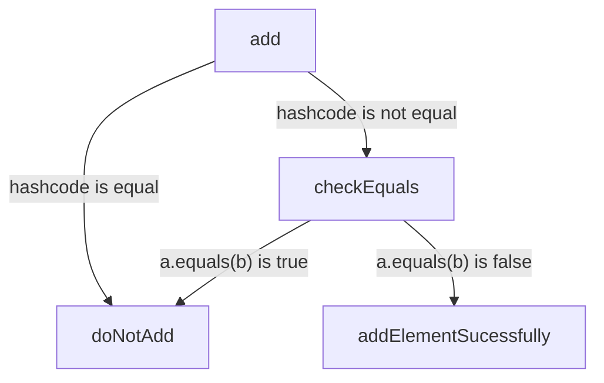

[Oracle resource](https://docs.oracle.com/javase/8/docs/technotes/guides/collections/overview.html)

![[Collections-1673103449610.jpeg]]

![[Collections-1673103299561.jpeg]]
![[Collections-1673179254153.jpeg]]

## For testing equality
![[Collections-1673179578561.jpeg]]

## Flow in HashSet while adding element

- [ ] resume from 608

