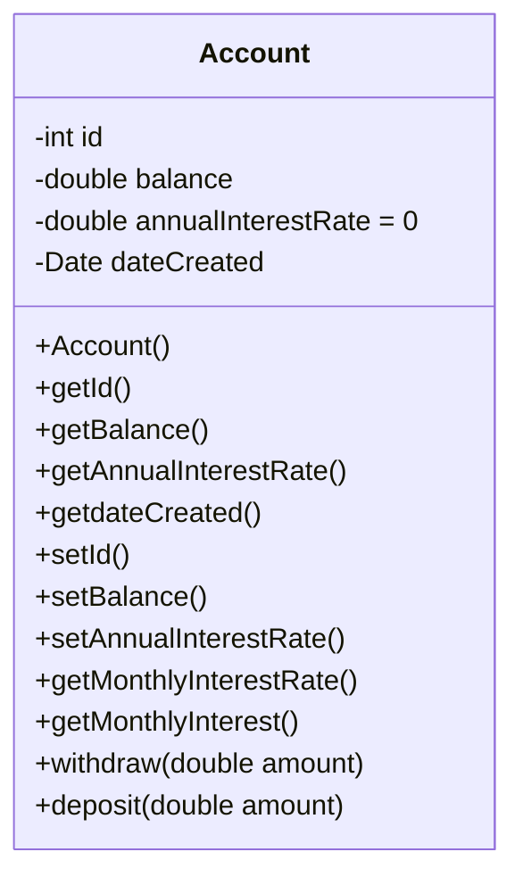

```mermaid
classDiagram
	class Account {
		-int id
		-double balance
		-double annualInterestRate = 0
		-Date dateCreated
		+Account()
		+getId()
		+getBalance()
		+getAnnualInterestRate()
		+getdateCreated()
		+setId()
		+setBalance()
		+setAnnualInterestRate()
		+getMonthlyInterestRate()
		+getMonthlyInterest()
		+withdraw(double amount)
		+deposit(double amount)
	}
```
