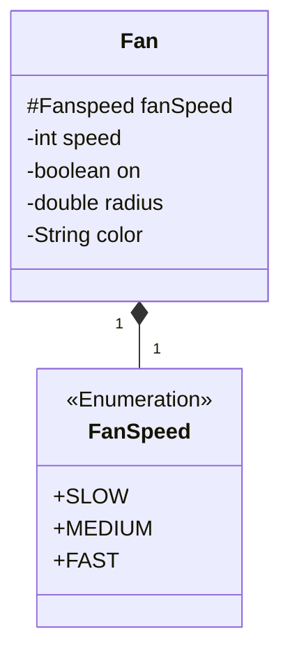

```mermaid
classDiagram
	class FanSpeed {
		+SLOW
		+MEDIUM
		+FAST
	} 
	<<Enumeration>> FanSpeed
	class Fan {
		#Fanspeed fanSpeed
		-int speed
		-boolean on
		-double radius
		-String color
	}
	Fan "1" *-- "1" FanSpeed
```

