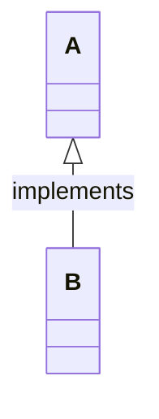

| Type  | Description   |
| ----- | ------------- |
| <\|-- | Inheritance   |
| \*--  | Composition   |
| o--   | Aggregation   |
| -->   | Association   |
| --    | Link (Solid)  |
| ..>   | Dependency    |
| ..\|> | Realization   |
| ..    | Link (Dashed) |

